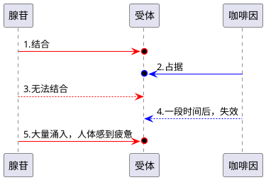

# 第 4 期

## 🌏图片

---

##### 1、[俄罗斯雕塑作品](https://twitter.com/tingyun97/status/1355904259326238722)

依次为：

“致那些为抗击新冠疫情牺牲的医务人员”纪念碑；

克麦罗沃苏联时代矿工纪念碑；

勒热夫纪念碑；

纪念卫国战争的雕塑《胜利者的母亲》。

##### 2、[1939 年，洛杉矶，罗纳德·里根，未来的美国总统，为雕塑作品建模](https://twitter.com/hu_lalalalala/status/1352498286729568256)

##### 3、[“最后的晚餐”](https://twitter.com/ken_waki_ken/status/1355048094971269120)

大阪艺术大学的一位食堂大叔工作四十年后退休了。

学生为了感谢大叔，与他一起拍摄了“最后的晚餐”。

##### 4、[1926 年，日本未来的天皇裕仁坐在赤坂皇宫的生物实验室里](https://twitter.com/hu_lalalalala/status/1355509855277219848)

## 📺资讯

---

##### 1、[咖啡因的工作原理](https://zhidao.baidu.com/question/121090035.html)

当人体很疲劳的时候，身体产生一种叫腺苷的信号物质来告诉大脑。

咖啡因的结构和腺苷类似，它们也可以和腺苷受体结合，但却不会抑制神经的兴奋性，这样你就能保持精力活跃。

而腺苷慢慢在体内积累。当咖啡因效力减退，人体会感到非常疲惫。

所以，咖啡因提神只是骗身体的感受罢了。

##### 2、[一群穷孩子的人生实验](https://weibo.com/ttarticle/p/show?id=2309404595026045829227)

十年前，北京有过一个叫「青云学子计划」的教育实验，从全市六十万打工子弟中挑选出最聪明的一批孩子，试图给他们提供稳定的、「因材施教」的教育，让他们不浪费天分，不从体制教育中滑落，最终能摆脱父辈的命运。

简单概括，就是在影响孩子成长的因素中，环境 > 学校 > 见识 > 知识了，

或者说“知识改变命运”并非知识本身改变命运，重要的是学知识的机会、学知识的过程。

##### 3、[AK-47 是如何工作的](https://twitter.com/hu_lalalalala/status/1353002511687274496)

<video src="https://cdn.jsdelivr.net/gh/dingeral/CDN/weekly/%E5%87%BA%E5%9F%83%E5%8F%8A%E8%AE%B0%20-%20AK-47%E6%98%AF%E5%A6%82%E4%BD%95%E5%B7%A5%E4%BD%9C%E7%9A%84.mp4" width="100%" height="100%" controls="controls">
Your browser does not support the video tag.
</video>

##### 4、[摇树机怎么采摘成熟的橘子？](https://twitter.com/nishuang/status/1355926059083059202)

<video src="https://cdn.jsdelivr.net/gh/dingeral/CDN/weekly/%E6%91%87%E6%A0%91%E6%9C%BA.mp4" width="100%" height="100%" controls="controls">
Your browser does not support the video tag.
</video>

##### 5、[能矫正近视的“智能眼镜”](https://asia.nikkei.com/Business/Health-Care/Myopia-correcting-smart-glasses-from-Japan-to-be-sold-in-Asia)

日本的久保田制药控股公司推出称为 Kubota Glasses 或智能眼镜的可穿戴设备。

它将图像从设备的镜头投射到佩戴者的视网膜上，以校正引起近视的屈光不正。据称，每天佩戴该设备 60 至 90 分钟可矫正近视。

##### 6、[猎鹰九号一箭 143 星](http://m.idai.ly/)

SpaceX 猎鹰 9 号火箭执行首次「小卫星拼单发射」任务，美国佛州。1 月 24 日，猎鹰 9 号火箭一次性将 143 颗小型卫星部署至地球极地轨道，成功打破单枚火箭发射卫星数量的世界纪录。本次「拼单发射」卫星来自 11 个国家和地区，多数为纳米、微小型卫星，轨道部署耗时超过半个小时。SpaceX 称每一个卫星都已纳入美国太空部队的追踪监控系统，以避免与其他太空器碰撞形成轨道垃圾。

## 📰文章

---

##### 1、[杂音](https://happyxiao.com/noise/)

去年 11 月，当「鬼灭之刃剧场版 无限列车篇」的票房即将超过「千与千寻」成为日本影史票房榜第 1 名时，有记者在宫崎骏家附近[贸然采访](https://japantoday.com/category/entertainment/hayao-miyazaki-asked-while-picking-up-trash-on-street-for-opinions-on-demon-slayer)了这位正在家门口捡垃圾的老先生。

当被问到对于「千与千寻」的票房纪录可能被打破有何看法时，宫崎骏说：

**我不认为这件事与我有何关系。相比较于票房，我觉得人们更应该关注如何把自己工作环境打造的更和谐。只要你在努力打造自己的作品便足够了。**

而关于「鬼灭之刃剧场版 无限列车篇」，他说：

**我没看过。我很少看其他的东西。我不看电视，不看电影。我只是一个在捡垃圾的退休老头。**

我想，宫崎骏的回复至少告诉了我这些信息：

1. 他爱干净（捡门外的垃圾），外部的整洁会带来内心的平静
2. 他也喜欢折腾工具（打造和谐的工作环境）
3. 别人的成功对于自己没有意义，避免庸人自扰
4. 杜绝杂音，关注自己的创作和作品

##### 2、[对一个族群的抹黑是如何实现的](https://zhuanlan.zhihu.com/p/80294584)

- **第一部分**

1950 年朝韩战争开始，韩国在以美国为首的联合国部队支援下，反攻朝鲜，节节进逼。眼看朝鲜军败退溃散，中国人民志愿军跨过鸭绿江，抗美援朝，将韩国本来的必胜之势阻断，局面转为拉锯战。最终战争双方于 1953 年达成停战协议，以三八线为界，维持朝韩两国的分裂局势。

在韩国人看来，是中国的参与破坏了半岛统一的机会，遗留了至今未能解决的朝韩问题的根源。在绝大多数韩国人的历史意识中，对中国之恨是根深蒂固的“国恨”。

这种情绪并没有被时间抹平。80 年代韩国仍出现大规模的反华示威游行。

这种情绪得到了各种形式的表达。

1989 年韩国驻美大使黄皙暎在与时任白宫亚太地区顾问费舍尔·劳伦斯会谈时，提出美国必须对中国在外交上采取步步紧逼、毫不松懈的方式，因为“中国是亚太地区最大的安全隐患”，他还说绝大多数韩国人认为中国“可憎”。（详见 1989 年 5 月韩民族日报）

波士顿大学东亚近代史教授克里斯·派克在其书《韩国的隐怒》（Korea’s hidden rage）中提到，中国在改革开放后经济发展本来可以更加迅速，但是明显受到了韩国的强力阻碍。

他引用了韩国国民教育教材中对中国的描述，其中诸如“野心”、“低劣”等负面词汇屡见不鲜。他在教育界、演艺界、政界、商界等许多领域都找到了韩国对中国的“暗算”、“伏击”的例子。在尾章，他评论说 “It is surprising how the Koreans’ hatred towards China can be so hidden in the public sphere, but so profoundly damaging in various practical ways.” （韩国人对中国的仇恨能够在公众范围如此隐秘，却又在许多实际方面极具破坏力，这实在令人惊讶）。

- **第二部分**

看完了第一部分，读者现在是什么感受？

我相信有不少人义愤填膺地要抵制韩星韩货了，因为“犯我中华者虽远必诛”。可能有人等不及要分享给自己身边“哈韩”的朋友们，并且要加上自己高屋建瓴的批评。更有甚者，可能有人基于此，会像专家一样大幅延伸、评论，提出种种“韩祸”的见解和“高见”。

好，那么有趣的部分来了。

**第一部分除了第一段，其他所有内容全部都是我喝着可乐胡编乱造出来的**，图文都是牛头不对马嘴，第一张是光州事件，第二张两个人我都不认识，“费舍尔·劳伦斯”是我自己创作的名字，“黄皙暎”是个我在网上随便找的韩国作家的名字。波士顿大学根本没有什么“克里斯·派克”（也是我编的名字），那张照片是我在谷歌上搜索 “random professor”（随便一个教授）显示的第一个：

根本没有什么《韩国的隐怒》，我编的，尾章的评论也是我编的，自己编英文，再自己翻译。

我为什么要这样做？

这是一个媒介素养教育（media literacy education）的练习——为了展示给中计的人，中计是多么容易，以及抹黑一个族群是如何实现的。

总结一下，这个过程通常有这么几个部分（无前后次序）

1. 有一定的事实成分作为基础，让人产生一种“可信”的错觉。这就是第一段的作用。

2. 对所描述族群进行大幅的怪责、道德污化，通常是基于虚假信息或含有真实成分但扭曲、夸大、歪解、断章取义的信息，引导读者的负面情绪，如反感、抵触、恐惧甚至仇恨。

3. 阻止与该族群的自由交流。（意思是说，对于有韩国朋友的读者，从第二段开始就知道我是在胡诌，但是对于从来没有跟韩国人交流过的读者，如果我不解释不知道会蒙在鼓里多久。）

拿一个真实案例来加深理解

在纳粹开始大规模迫害犹太人之前，他们先利用媒体对犹太人进行了“宣传战”，提出犹太人是德国经济危机和一战战败的主要原因，这个宣传过程包含了上面的第一和第二点。

紧接着，1933 年开始，纳粹开始用法律限制犹太人的自由流动和自由表达，犹太人不可以上公立学校、不可以去剧院、影院和度假村，甚至德国大城市的有些片区，都不允许犹太人进入。而对国民其余 99% 的非犹太人，则继续宣传犹太人的“阴谋”、“分裂”、“恐怖”、“极端”、“暴力”、“危险”。由于缺乏交流，这 99% 的大多数人很容易相信国家宣传的是真相。这是上面的第三点。

这个过程最终引致了何等的悲惨，相信大家都熟悉，我就不再赘述了。

- **第三部分**

大家现在看到，如果有人想刻意抹黑一个族群，在信息快餐化的今天，似乎一点都不难。如果再佐以信息来源的选择性封闭，使信息接收者只能接受经过刻意筛选的部分信息，那引导人们仇恨一个族群简直是唾手可得。

想象一下，如果我没有在第二部分说第一部分全部都是胡诌，而且如果第一部分的内容在网络上广为传播，人们又不断发酵，会造成什么样的后果？再如果，有头脑清楚的人站出来反驳，说我是在信口开河，但是这样的人被大部分网友攻击，说他们“洗地”，说他们“圣女”，说他们不辨黑白不明是非，那会造成什么样的后果？更如果，这些头脑清楚且在调查后用事实证明我是在胡说八道的人，根本就没有发出声音的机会，他们对我证伪的文章，出于某种原因，都被删了，都被投诉了，都看不到，那会造成什么样的后果？

如果我胡诌的不是关于韩国人，是关于某一个民族，或某一个宗教，或某一个地区，那么会造成什么样的后果？

希望大家有产生一些有益的思考。媒介素养教育在中国还有很长的路要走，希望这篇文章起到了一点微薄的作用。

## 📢言论

---

1、

我一直认为个人成长与人生选择过程中有三个悖论:

16 - 18 岁在对学科与知识一无所知的时候就被要求选择自己的专业

22 - 25 岁在对商业世界运行规则毫无概念的时候就被要求选择工作方向

25 - 28 岁在对自己和人际关系一知半解的情况下就被要求确定长期伴侣

这样想来，其实人生出问题是一个大概率事件。

— [路易时七 ⚙️『空想社会主义版』](https://twitter.com/EnmadeMedici/status/1352983433224495104)

2、

工具替代的是工人的体力劳动，创造性工作、协调性工作、管理性质的工作……等等都很难用工具来替代

你看人人电脑上都有 Word，万能写作工具，世界 500 强和一流作家的共同选择，但是有了 Word、绝绝绝大多数人连 100 字的个人简介都写不出来

保持竞争力，最常见的办法是学习体力劳动之外的技能

— [倪爽](https://twitter.com/nishuang/status/1354330234536013824)
 
 
 
 
 
 